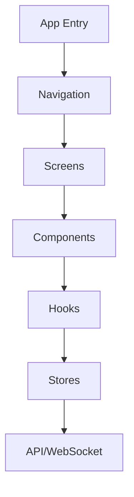
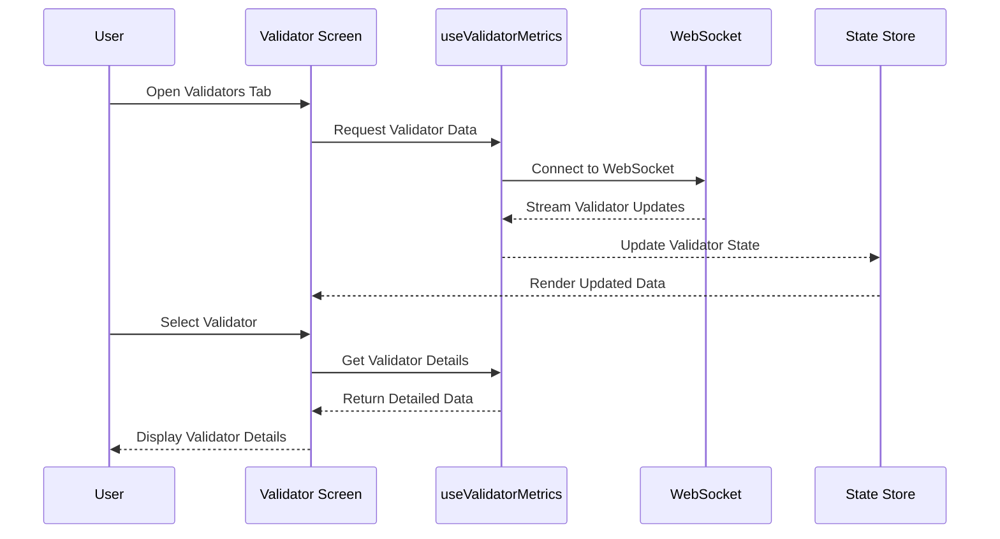
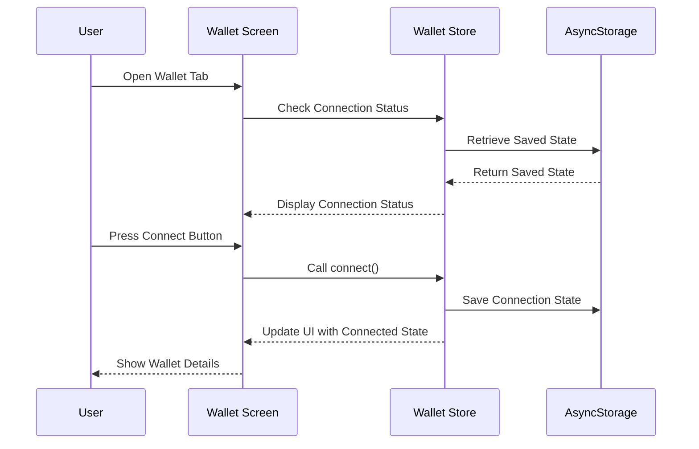
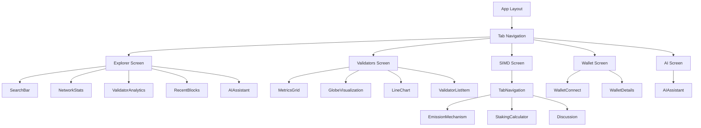

# OpenSVM Mobile Architecture

This document provides a detailed overview of the OpenSVM Mobile application architecture, explaining the project structure, key components, data flow, and design patterns.

## Application Architecture

OpenSVM Mobile follows a modular architecture with clear separation of concerns:

### Key Architectural Components

1. **Navigation (Expo Router)**: Handles routing and navigation between screens
2. **Screens**: Main UI views for different app sections
3. **Components**: Reusable UI elements
4. **Hooks**: Custom React hooks for business logic and data fetching
5. **Stores**: Global state management using Zustand
6. **API/WebSocket**: Communication with backend services

## Directory Structure

### `/app` Directory

The `/app` directory uses Expo Router's file-based routing system:

- `_layout.tsx`: Root layout component with global styling and navigation setup
- `(tabs)/_layout.tsx`: Tab-based navigation configuration
- `(tabs)/index.tsx`: Explorer screen (home)
- `(tabs)/validators.tsx`: Validator monitoring screen
- `(tabs)/solanow.tsx`: SIMD-0228 proposal screen
- `(tabs)/wallet.tsx`: Wallet management screen
- `(tabs)/ai.tsx`: AI Assistant screen
- `account/[id].tsx`: Dynamic route for account details
- `transaction/[id].tsx`: Dynamic route for transaction details

### `/components` Directory

Reusable UI components organized by functionality:

- `NetworkStats.tsx`: Displays blockchain network statistics
- `ValidatorAnalytics.tsx`: Shows validator performance metrics
- `AIAssistant.tsx`: AI chat interface for user assistance
- `SearchBar.tsx`: Search functionality for blockchain data
- `WalletButton.tsx`: Wallet connection button
- `charts/`: Visualization components for data display
  - `LineChart.tsx`: Line chart for time-series data
  - `GlobeVisualization.tsx`: Global map of validator distribution
  - `MetricsGrid.tsx`: Grid display of performance metrics

### `/hooks` Directory

Custom React hooks for data fetching and business logic:

- `use-validator-metrics.ts`: Fetches and processes validator performance data
- `use-network-stats.ts`: Retrieves blockchain network statistics
- `use-websocket.ts`: WebSocket connection management
- `use-github-discussions.ts`: Fetches GitHub discussion data for SIMD proposal

### `/stores` Directory

Zustand stores for global state management:

- `wallet-store.ts`: Manages wallet connection state and address
- `theme-store.ts`: Handles application theme settings

### `/constants` Directory

Application-wide constants:

- `colors.ts`: Color palette for UI elements
- `typography.ts`: Typography settings

### `/utils` Directory

Utility functions:

- `address-utils.ts`: Helper functions for Solana address formatting

### `/types` Directory

TypeScript type definitions:

- `blockchain.ts`: Types for blockchain data structures

### `/mocks` Directory

Mock data for development and testing:

- `github-thread.ts`: Mock GitHub discussion data

## Data Flow

### Validator Monitoring Flow

### Wallet Connection Flow

## State Management

The application uses Zustand for state management with the following stores:

1. **Wallet Store**: Manages wallet connection state
   - `isConnected`: Boolean indicating connection status
   - `address`: Connected wallet address
   - `connect()`: Function to connect wallet
   - `disconnect()`: Function to disconnect wallet

2. **Theme Store**: Manages application theme
   - `theme`: Current theme (light/dark)
   - `setTheme()`: Function to change theme

## UI Component Hierarchy

## Key Features Implementation

### Blockchain Explorer

The Explorer screen (`app/(tabs)/index.tsx`) provides a search interface for blockchain data and displays network statistics. It uses the `SearchBar` component for queries and `NetworkStats` to show current blockchain metrics.

### Validator Monitoring

The Validators screen (`app/(tabs)/validators.tsx`) displays real-time validator performance metrics. It uses the `useValidatorMetrics` hook to fetch and process validator data, and visualizes it using various chart components.

### SIMD-0228 Proposal

The SIMD screen (`app/(tabs)/solanow.tsx`) provides an interactive simulation of the proposed market-based emission mechanism. It includes formula visualization, interactive sliders, and a staking calculator.

### Wallet Management

The Wallet screen (`app/(tabs)/wallet.tsx`) allows users to connect their Solana wallet and view their address. It uses the `useWalletStore` for state management and persists connection state using AsyncStorage.

### AI Assistant

The AI Assistant (`app/(tabs)/ai.tsx` and `components/AIAssistant.tsx`) provides a chat interface for users to ask questions about Solana and receive assistance with using the application.

## Future Architecture Considerations

1. **Real API Integration**: Replace mock data with real API endpoints for blockchain data
2. **Wallet SDK Integration**: Integrate with Solana wallet SDKs for full wallet functionality
3. **Offline Support**: Implement caching and offline capabilities
4. **Performance Optimization**: Optimize rendering and data processing for large datasets
5. **Testing Strategy**: Implement comprehensive testing for components and business logic