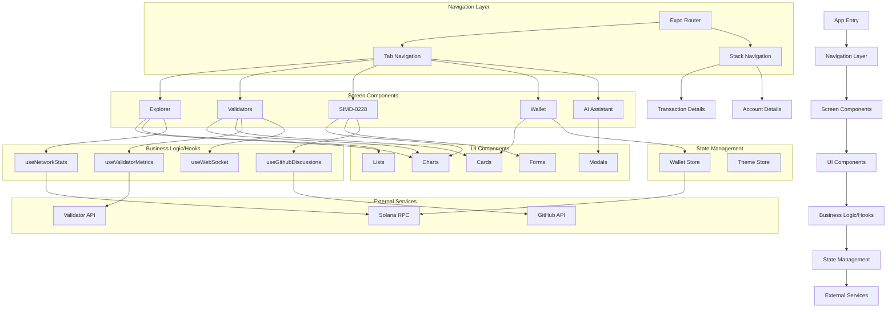
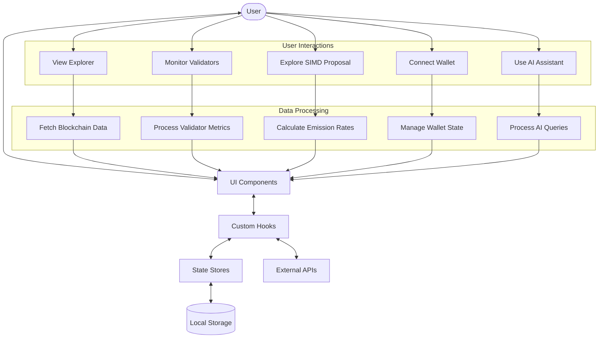
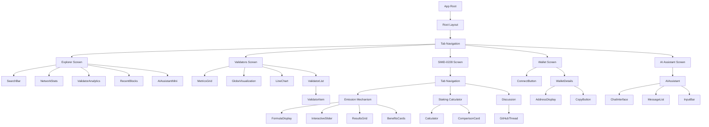
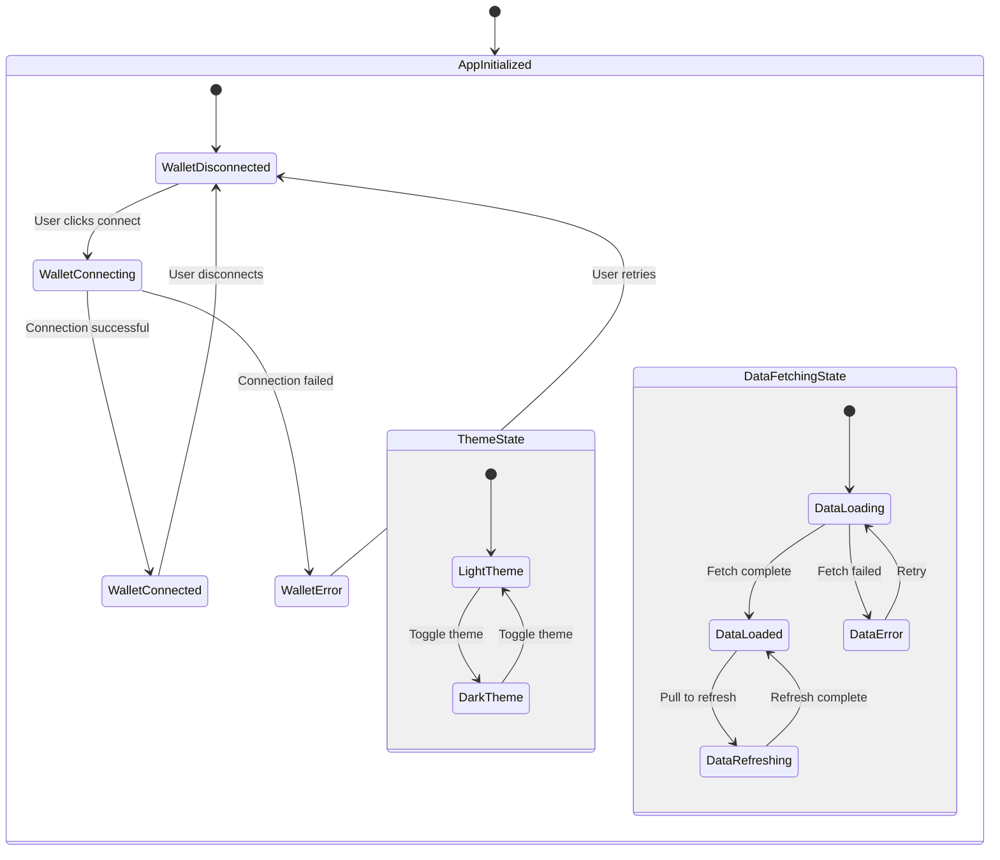
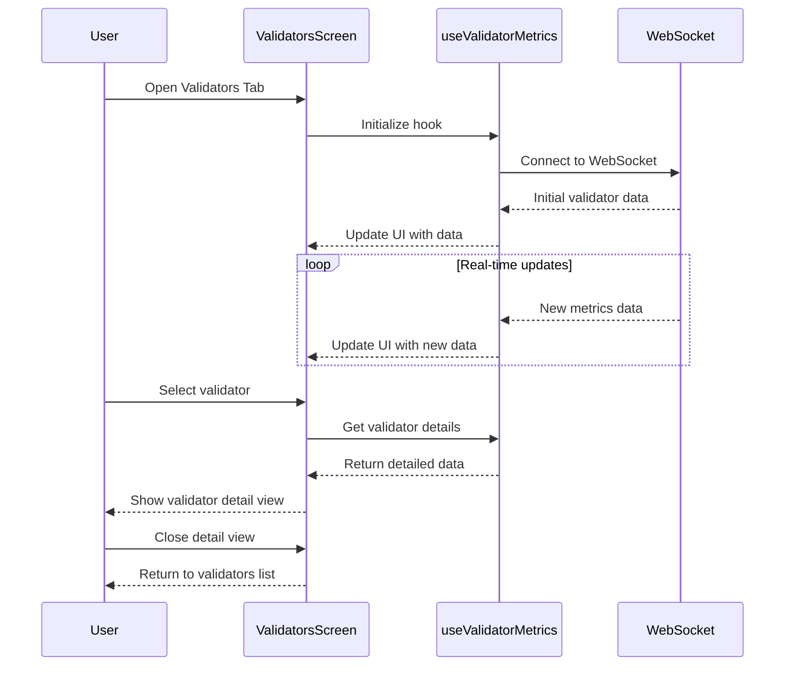
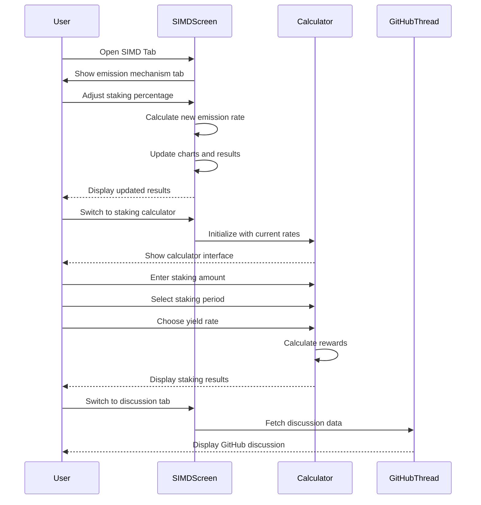
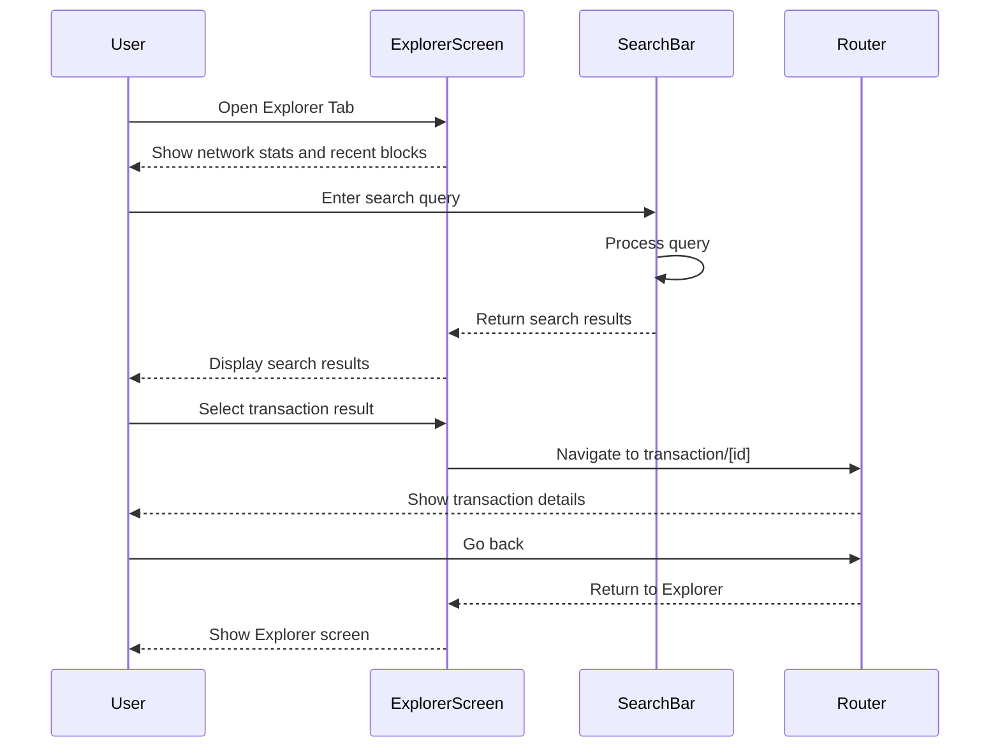
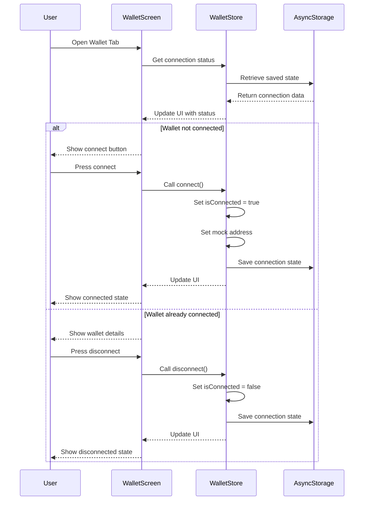
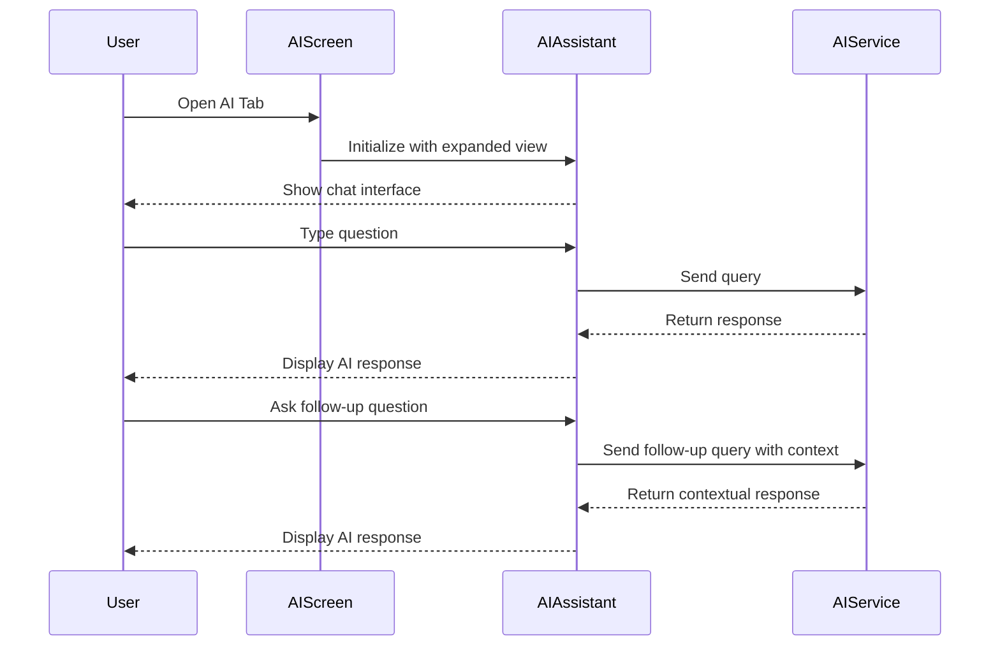
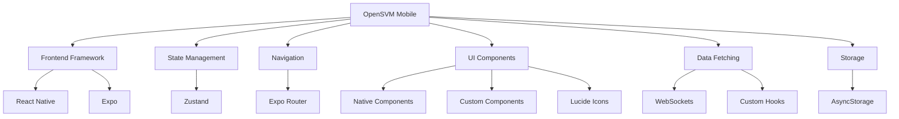

# OpenSVM Mobile Diagrams

This document contains visual diagrams to help understand the OpenSVM Mobile application structure, data flow, and component relationships.

## Application Architecture

## Data Flow Diagram

## Component Hierarchy

## State Management

## Validator Monitoring Flow

## SIMD-0228 Proposal Flow

## Explorer Search Flow

## Wallet Connection Flow

## AI Assistant Flow

## Technology Stack

