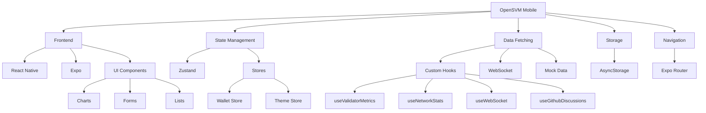
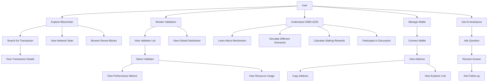
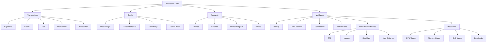
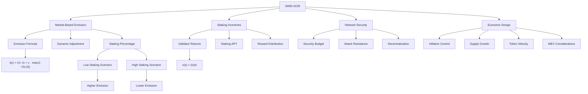
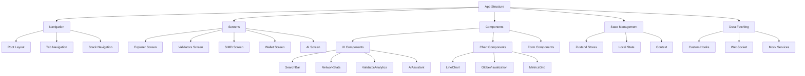
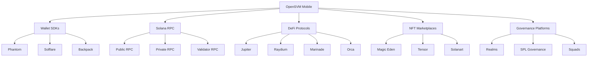

# OpenSVM Mobile Knowledge Graph

This document provides a conceptual knowledge graph of the OpenSVM Mobile application, showing the relationships between different components, features, and concepts.

## Core Concepts

```mermaid
graph TD
    A[OpenSVM Mobile] --> B[Blockchain Explorer]
    A --> C[Validator Monitoring]
    A --> D[SIMD-0228 Proposal]
    A --> E[Wallet Management]
    A --> F[AI Assistant]
    
    B --> B1[Transactions]
    B --> B2[Blocks]
    B --> B3[Accounts]
    B --> B4[Network Stats]
    
    C --> C1[Performance Metrics]
    C --> C2[Global Distribution]
    C --> C3[Resource Usage]
    C --> C4[Validator Rankings]
    
    D --> D1[Emission Mechanism]
    D --> D2[Staking Calculator]
    D --> D3[Community Discussion]
    
    E --> E1[Wallet Connection]
    E --> E2[Address Management]
    E --> E3[Transaction History]
    
    F --> F1[Query Processing]
    F --> F2[Blockchain Knowledge]
    F --> F3[User Assistance]
    
    B1 --> G1[Transaction Details]
    B2 --> G2[Block Details]
    B3 --> G3[Account Details]
    
    C1 --> H1[TPS]
    C1 --> H2[Latency]
    C1 --> H3[Skip Rate]
    C1 --> H4[Vote Distance]
    
    D1 --> I1[Emission Formula]
    D1 --> I2[Staking Percentage]
    D1 --> I3[Validator Returns]
```

## Technology Stack

## Solana Blockchain Concepts

```mermaid
graph TD
    A[Solana Blockchain] --> B[Consensus]
    A --> C[Tokenomics]
    A --> D[Validators]
    A --> E[Transactions]
    A --> F[Programs]
    
    B --> B1[Proof of Stake]
    B --> B2[Proof of History]
    B --> B3[Tower BFT]
    
    C --> C1[SOL Token]
    C --> C2[Inflation]
    C --> C3[Staking]
    C --> C4[SIMD-0228]
    
    D --> D1[Validator Nodes]
    D --> D2[Stake Delegation]
    D --> D3[Vote Accounts]
    D --> D4[Commission]
    
    E --> E1[Transaction Structure]
    E --> E2[Instructions]
    E --> E3[Signatures]
    E --> E4[Fees]
    
    F --> F1[Smart Contracts]
    F --> F2[System Program]
    F --> F3[Token Program]
    F --> F4[DeFi Programs]
    
    C4 --> G1[Market-Based Emission]
    C4 --> G2[Staking Participation]
    C4 --> G3[Validator Returns]
    
    D1 --> H1[Performance]
    D1 --> H2[Resources]
    D1 --> H3[Location]
    D1 --> H4[Version]
```

## User Journeys

## Data Relationships

## SIMD-0228 Concepts

## Application Architecture

## Future Integration Possibilities

